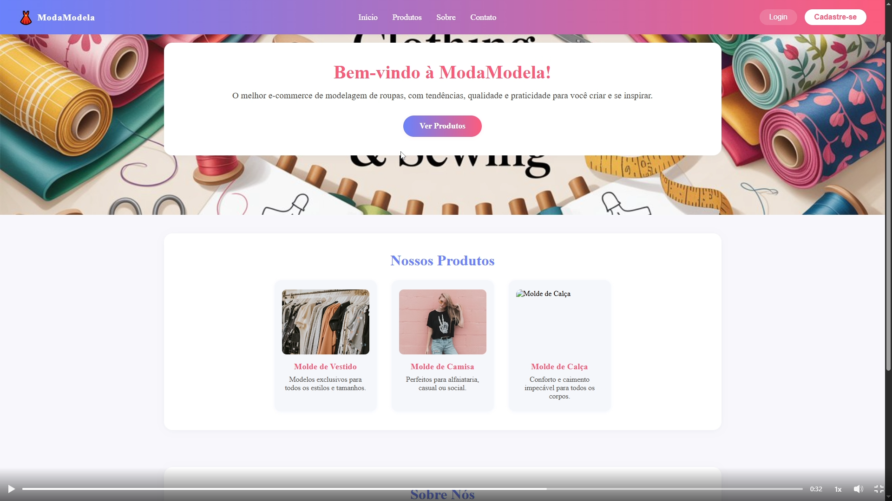

# ModaModela 

ModaModela é um e-commerce de modelagens de roupas, onde usuários podem se cadastrar, fazer login e comprar modelagens digitais. A plataforma também conta com uma área administrativa para gerenciamento dos produtos.

## Funcionalidades

- Cadastro e login de usuários
- Autenticação com JWT e cookies
- Compra de modelagens de roupas
- Área administrativa protegida
- Cadastro, edição e exclusão de modelagens (admin)
- Sistema de autenticação com tokens

## Tecnologias

### Frontend
- React

### Backend
- CakePHP

### Autenticação
- JWT (JSON Web Token)
- Cookies
- Tokens de sessão

### Banco de Dados
- MySQL

## Screenshot

### Página inicial

## Como rodar o projeto

### Clone o repositório
``bash
git clone https://github.com/Carmo22b/modaModela.git

cd backend
composer install <--- Faz só a primeira vez;
bin/cake server

cd frontend
npm install <--- Faz só a primeira vez;
npm run dev

## Autor

Desenvolvido por Carmo

- GitHub: https://github.com/Carmo22b
- Portfólio: https://carmo22b.github.io/Portf-lio/

## Melhorias futuras

- Integração com pagamento online
- Upload de imagens pelos administradores
- Sistema de avaliações de produtos
- Deploy em produção
